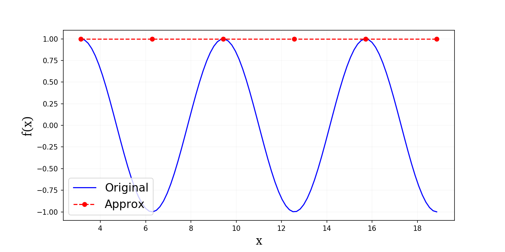
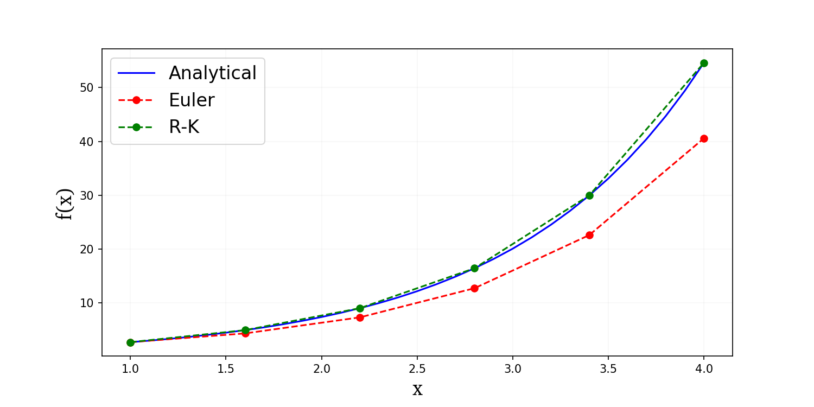

# Numerical integration

## Euler method

`Jupyter notebooks`:

- [Some examples of using the Euler method](https://github.com/camillejr/numerical-methods/blob/master/numerical-integration/Euler-method.ipynb)

- [Comparison of Euler method with 4th order Runge-Kutta](https://github.com/camillejr/numerical-methods/blob/master/numerical-integration/compare-Euler-and-Runge-Kutta-4th-order.ipynb)

### Successes and failures of the Euler method

Here's a fun example of the Euler method gone wrong!

And here's a cool comparison of how Runge-Kutta can be better than Euler!

